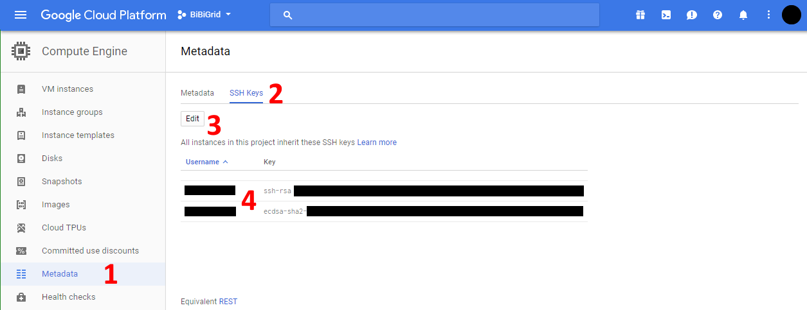
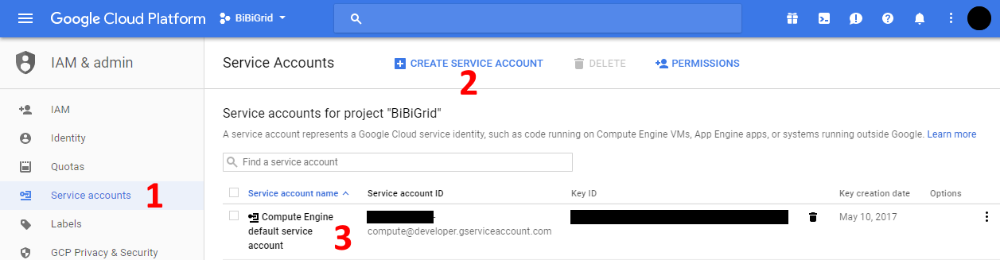

# Google compute credentials setup
Setting up the Google compute credentials involves two parts.

## Instance access SSH keys
In order for the BiBiGrid tool to access the master instance during setup and for your
own access after the cluster is created, a public key needs to be uploaded. In the google
cloud console navigate to **Compute Engine** > **Metadata** (1) and select the tab
**SSH Keys** (2). The **Edit** Button (3) allows you to add a new public ssh key.
Be aware that an email address should be specified as the keys comment string. Google
then automatically uses the prefix of the address as the user name. This user name
needs to be provided as the **sshUser** parameter for the cluster setup. The added keys
are listed below (4).

*Figure 1: Google cloud console SSH Keys*

## API service account
In order for the BiBiGrid tool to access the Google cloud compute API a service account
needs to be created. For this, navigate to **IAM & Admin** > **Service accounts** (1).
Here you can **create** a new service account (2) and download the service account
file including a generated private key. The created service accounts are listed below (3).
Make sure to keep the service account file safe since it allows access to all resources.
If you loose the file, the service account can't be used anymore and a new one needs to
be created. The path to the service account file is used with the "credentials file" parameter.

*Figure 2: Google cloud console IAM service accounts*
