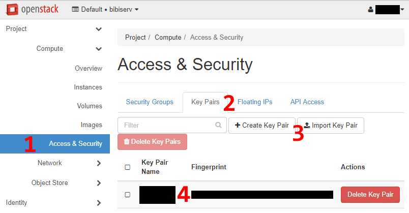
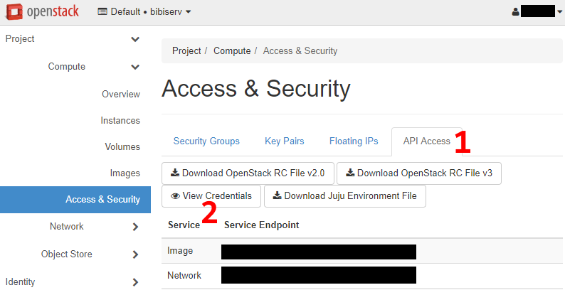

# OpenStack credentials setup
Setting up the OpenStack credentials involves two parts.

## Instance access SSH keys
In order for the BiBiGrid tool to access the master instance during setup and for your
own access after the cluster is created, a keypair needs to be generated or uploaded.
In the horizon dashboard navigate to **Access & Security** (1) and open the tab
**Key Pairs** (2). You can either **create** a new keypair (3) or **import** an existing
one (3). After the key is successfully setup, a new entry will show in the list (4).
The **Key Pair Name** needs to be referenced in the configuration file or command line
in order to create a new cluster.



*Figure 1: Horizon dashboard Key Pairs*

## API credentials
In order for the BiBiGrid tool to access the OpenStack API, several information
need to be collected. Most of them can be found in the horizon dashboard as seen in
Figure 2. In the same menu entry **Access & Security** as before, navigate to the tab
**API Access** (1) and click **View Credentials** (2).



*Figure 2: Horizon dashboard API access*

For a complete list of parameters needed see the [configuration file schema](../../docs/CONFIGURATION_SCHEMA.md).

It is recommended to pass the credentials to bibigrid using a configuration file instead
of the command line. In addition, the password can only be set this way and not via the
command line for security reasons. Otherwise it would be possible to extract the password
from the list of running processes!

The simple way to provide the credentials to bibigrid is directly in the configuration file
as seen in the [schema](../../docs/CONFIGURATION_SCHEMA.md). In addition, the credentials
can be passed using a separate credentials file. The format is basically the same as for the
normal configuration file, except the "openstackCredentials" group is removed.

### Example for the credentials in the normal configuration file:

*.bibigrid.yml*
```
[...]
openstackCredentials:
  tenantName: XXX
  username: XXX
  password: XXX
  endpoint: XXX
  domain: XXX
  tenantDomain: XXX
[...]
```

### Example for the credentials in a separate credentials file:

*.bibigrid.yml*
```
[...]
credentialsFile: credentials.yml
[...]
```

*credentials.yml*
```
tenantName: XXX
username: XXX
password: XXX
endpoint: XXX
domain: XXX
tenantDomain: XXX
```
