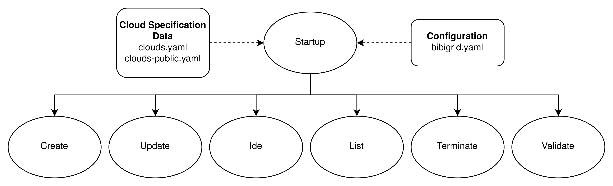

# BiBiGrid Features

|                               Name                               |                                                           Purpose                                                           |
|:----------------------------------------------------------------:|:---------------------------------------------------------------------------------------------------------------------------:|
|                  [Version](features/version.md)                  |                                 Returns BiBiGrid's version for opening issues and the like                                  |
|        [Terminate Cluster](features/terminate_cluster.md)        |     Terminates the cluster specified by cluster-id i.e. removes key, application credentials, servers and floating-ips.     |
|                   [Create](features/create.md)                   |                                     Creates the cluster specified by the configuration.                                     |
 |            [List Clusters](features/list_clusters.md)            | Shows info of all clusters if no cluster-id is specified. Otherwise the cluster-id's cluster will be shown in great detail. |
|                    [Check](features/check.md)                    |                      Checks if given configuration is valid and necessary security measures are taken.                      |
|                    [Web IDE](features/ide.md)                    |             Connects to running IDE of cluster-id's cluster. Requires that given cluster was setup with an ide.             |
|                   [Update](features/update.md)                   |   Updates the master's playbook and runs that playbook for the master. Requires that no job is running and no workers up.   |
| [Cloud Specification Data](features/cloud_specification_data.md) |                         Contains necessary data to establish a general connection to the provider.                          |
 |            [Configuration](features/configuration.md)            |                                Contains all data regarding cluster setup for all providers.                                 |
|            [Command Line Interface](features/CLI.md)             |                                  What command line arguments can be passed into BiBiGrid.                                   |

