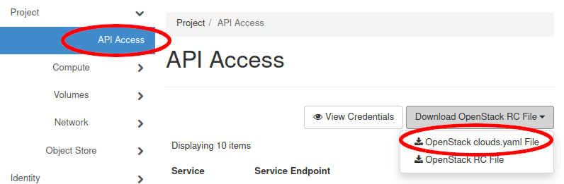
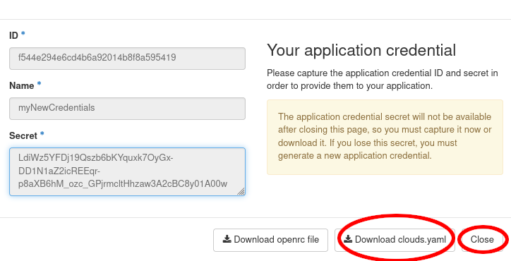

# Cloud Specification Data

To access clouds, authentication information is required. BiBiGrid no longer uses environment variables, but an already 
established two file system instead.
Those two files, `clouds.yaml` and `clouds-public.yaml`, can be placed in `~/.config/bibigrid/` or `/etc/bibigrid/`.

While you should store your password and username in `clouds.yaml` (private), you can store all other information ready
to share in `clouds-public.yaml` (shareable). However, splitting information is not necessary.
You can work with just a `clouds.yaml` containing all the data, too. OpenStack will not split information into both
files, but just provides a single large `clouds.yaml`.

Be aware that keys set in `clouds.yaml` will overwrite keys from `clouds-public.yaml`.

In order to authenticate you either need to provide your [username and password](#password-example), 
or provide an [application credentials](#application-credentials-example) (safer).

## Providers
### Openstack
#### Password Example

Using the password `clouds.yaml` is easy. However, since passwords -
unlike [Application Credentials](#application-credentials-example)
don't have an expiration date, caution is advised.



Move the downloaded file to `~/.config/bibigrid/` or `/etc/bibigrid/`.

##### Password clouds.yaml

```yaml
clouds:
  openstack:
    profile: nameOfCloudsPublicYamlEntry
    auth:
      username: SamSampleman
      password: SecurePassword
```

##### Password clouds-public.yaml

```yaml
public-clouds:
  nameOfCloudsPublicYamlEntry:
    auth:
      auth_url: https://somelink:someport
      project_id: someProjectId
      project_name: someProjectName
      user_domain_name: someDomainName
    region_name: someRegionName
    interface: "public"
    identity_api_version: 3
```

#### Application Credentials Example

The following shows, how to create an application credential and how to download the related `clouds.yaml`.
Application Credentials are the preferred way of authentication since they do have an expiration date and
their access can be limited.




Move the downloaded file to `~/.config/bibigrid/` or `/etc/bibigrid/`.

##### Application Credential clouds.yaml

```yaml
clouds:
  openstack:
    profile: nameOfCloudsPublicYamlEntry
    auth:
      application_credential_id: SomeID
      application_credential_secret: SecureSecret
```

##### Application Credential clouds-public.yaml

```yaml
public-clouds:
  nameOfCloudsPublicYamlEntry:
    auth:
      auth_url: https://somelink:someport
    region_name: SomeRegion
    interface: "public"
    identity_api_version: 3
    auth_type: "v3applicationcredential"
```

## The identifier Key
In the examples below you will see the `identifier` key. That key doesn't exist in regular `clouds.yaml` files.
This key allows you to use a non-unique identifier that will be shown in debugging and as your slurm partition name.
You do not need to set it. In that case the key under `clouds` is taken (`openstack` in the examples above).

## Multiple Clouds
If you are using BiBiGrid's Multi Cloud setup, you just need to save the information 
of both clouds into a single `clouds.yaml` and optionally `clouds-public.yaml`.
Make sure that they are named differently.

### Multiple Clouds Example

```yaml
clouds:
  openstack_location1:
    profile: nameOfCloudsPublicYamlEntry
    auth:
      username: SamSampleman
      password: SecurePassword
  openstack_location2:
    auth:
      auth_url: https://somelink:someport
      application_credential_id: SomeID
      application_credential_secret: SecureSecret 
    region_name: SomeRegion
    identifier: location2
    interface: "public"
    identity_api_version: 3
    auth_type: "v3applicationcredential"
```

```yaml
public-clouds:
  nameOfCloudsPublicYamlEntry:
    auth:
      auth_url: https://somelink:someport
      project_id: someProjectId
      project_name: someProjectName
      user_domain_name: someDomainName
    region_name: someRegionName
    interface: "public"
    identifier: location1
    identity_api_version: 3
```